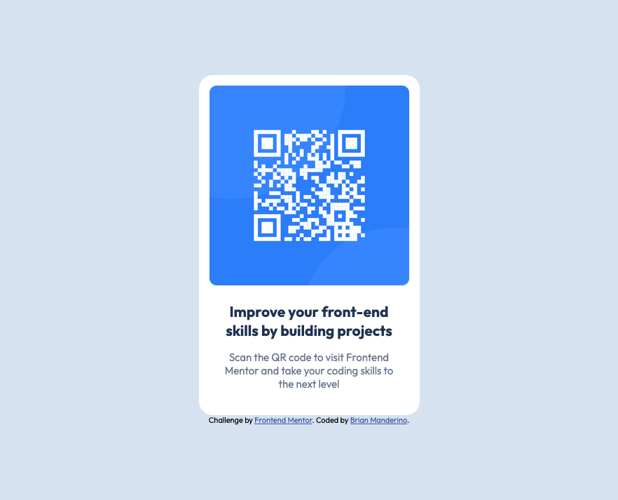

# Frontend Mentor - QR code component solution

This is a solution to the [QR code component challenge on Frontend Mentor](https://www.frontendmentor.io/challenges/qr-code-component-iux_sIO_H). Just getting my barings around the Frontend Mentor site, so this repo now exists.

## Table of contents

-   [Frontend Mentor - QR code component solution](#frontend-mentor---qr-code-component-solution)
    -   [Table of contents](#table-of-contents)
    -   [Overview](#overview)
        -   [Screenshot](#screenshot)

## Overview

### Screenshot

